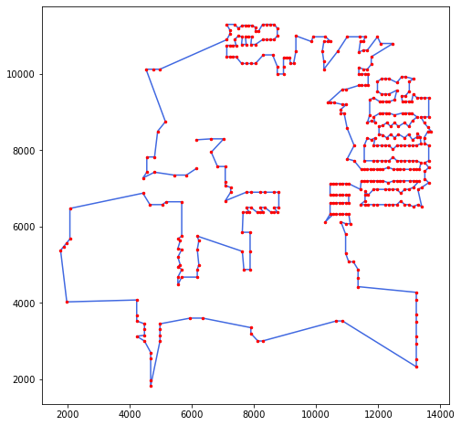
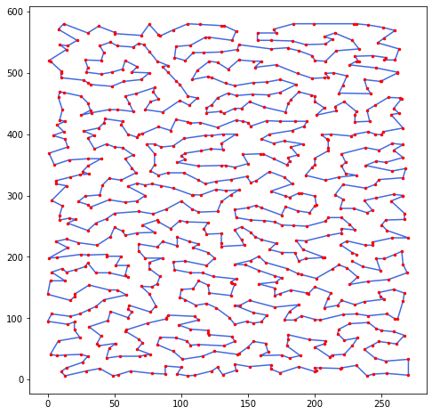
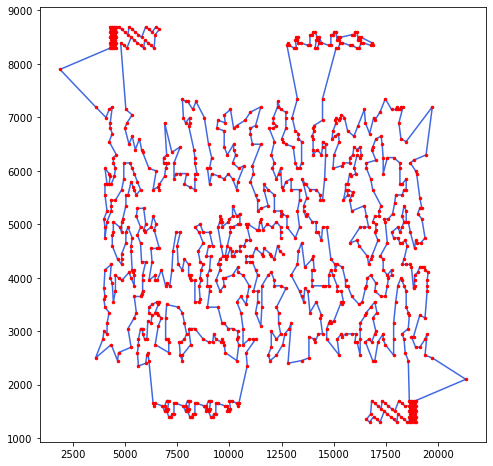

# Ant Colony Optimization

#### Implementation

This program approximates solutions to the Travelling Salesman Problem (TSP) using the Ant Colony Optimization (ACO) with some additional features.

The random number $q_0$ that decides between exploration and exploitation is set to $1.0-(18.0/n)$

The value of $\rho$ for the local pheromone update is set to $0.3$, while $\alpha$ for the global update is set to $0.1$.

The initial pheromone guess $\tau_0$ Is set to be $(n \cdot nn)^{-1}$ where $math=nn$ is the length found with the nearest neighbour, which is always run starting from city 0.

When all the ants have completed a tour (at the end of each iteration), one of them is picked so that their current tour is improved with a local search. The "lucky ant" is alternating every iteration between being the ant with the best tour length in the current iteration and a randomly chosen ant. This is because we can not exclude that an ant that has a current longer path is located in the area of the global minimum (just not reached yet), while the best ant is just located in a local minimum area.

The local search is also alternating between a **2OPT** and a **2.5OPT**. 

With some trials, I found out that it is a good idea to reduce the number of swaps that the 2opt performs, allowing to get more iterations done. For this reason, each step of the 2opt only swaps the couple i,j that has the best gain.

#### How to run

To run all instances run `make compile` and `make runall`.

To run individual instances I advise to compile the program with `-O3` flag as follows: `c++ -std=c++11 -O3 aco.cpp -o aco ` . Then run the executable as `./aco {PATH_TO_PROBLEM}/{PROBLEM}.tsp  {SEED}  `. The given seed allows the results to be replicable, since the sequence of random numbers will be the same each time.

The program stops either when the best known solution is found or 3 minutes have passed.

With a time limit of 3 minutes and without farming a lucky seed, the following result could be achieved:

| Problem: | Best Known: | Result: | Error: |
| -------- | ----------- | ------- | ------ |
| ch130    | 6110        | 6110    | 0%     |
| d198     | 15780       | 15780   | 0%     |
| eil76    | 538         | 538     | 0%     |
| fl1577   | 22249       | 22368   | 0.53%  |
| kroa100  | 21282       | 21282   | 0%     |
| lin318   | 42029       | 42143   | 0.27%  |
| pcb442   | 50778       | 51094   | 0.62%  |
| pr439    | 107217      | 107294  | 0.07%  |
| rat783   | 8806        | 8888    | 0.93%  |
| u1060    | 224094      | 227814  | 1.66%  |

The mean error is $0.40$

Note that the parameters were fixed and some problems work better with certain set of parameters. This was a try to get an overall good result.

Following are some examples of results:

- PR439

- RAT783

- U1060

